# Football Champions

URL: https://f-clement.github.io/football-champion/

Football champions is a website that intends to test the knowledge of football lovers. It does this by asking who were the champions for a particular year and tournament. The tournaments included are the World Cup, The African Nations Cup (AFCON) the Champions League and the Ballon D'or awards. The test always starts with the world cup questions and then move to the AFCON questions when user has finished answering the World Cup questions. After the user is done with the AFCON questions he or she moves to the Champions Leagues questions and so on to the Ballon D'Or questions. At the end the user's score is published as a percentage. There are 6 questions for the World Cup, 7 questions for the AFCON, 13 questions for the Champions League and 9 Ballon D'Or questions. For each user, the questions for each tournament are asked randomly.
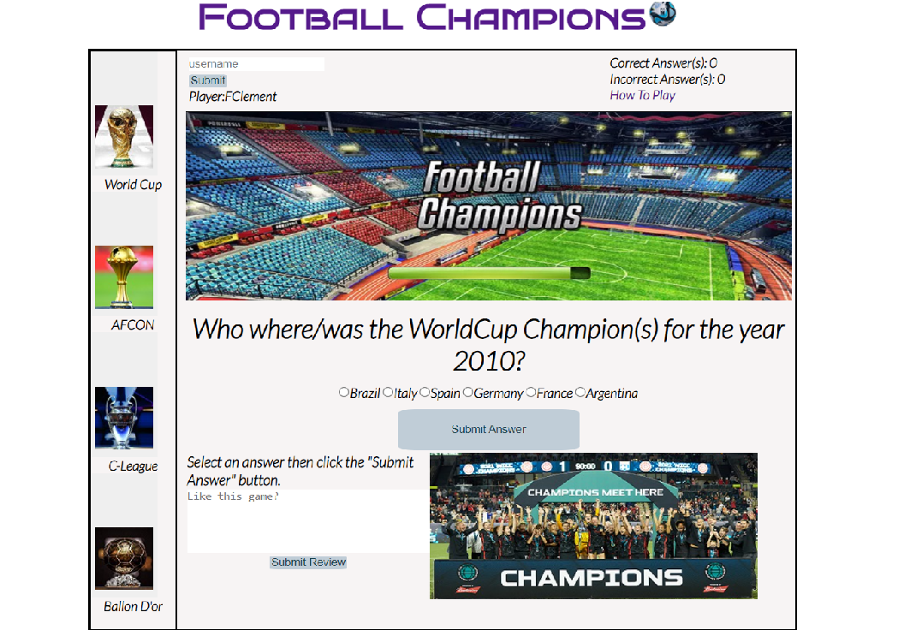
## Design

We used [Figma](figma.com) to design two different displays of this website. We have a desktop display which is thesame when you use a tablet, and a mobile phone display.

- Destop display
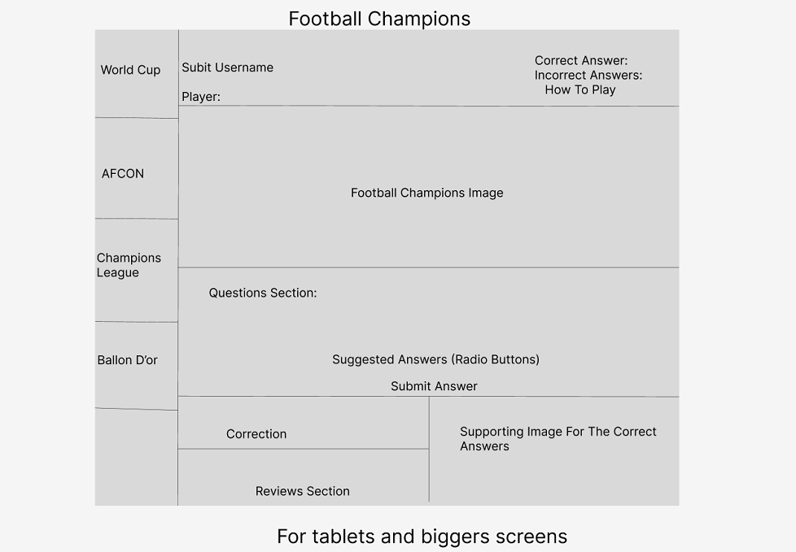

- Phone display
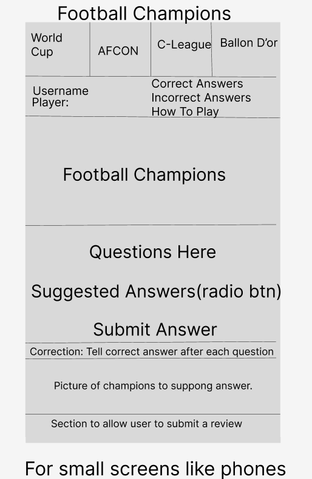

## Existing Features

#### A Side Bar
This side bar is were you will find the various tournaments you can play. It contains image buttons that represents the World Cup, The African Nations Cup (AFCON) the Champions League and the Ballon D'or award. It is positioned vertically to the left for large screens and at horizontally at the top for smaller screens.

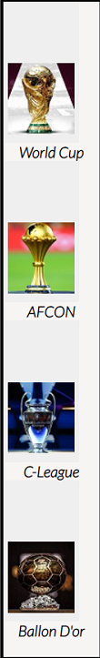

#### Username and Score
Here we intend for the user to be able to submit a username(located to the left) before getting access to questions. Then to the right is the feature to keep count of the score. So user inputs his or her name then click on the submit button. For each correct or incorrect answer the user submits, the counter increments the score respectively.
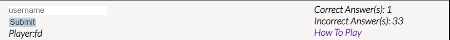

#### Main Image
What you immediatly see when the site loads is an image with text Football Champions. This image is intended to get the users attention on the main topic of the website. 
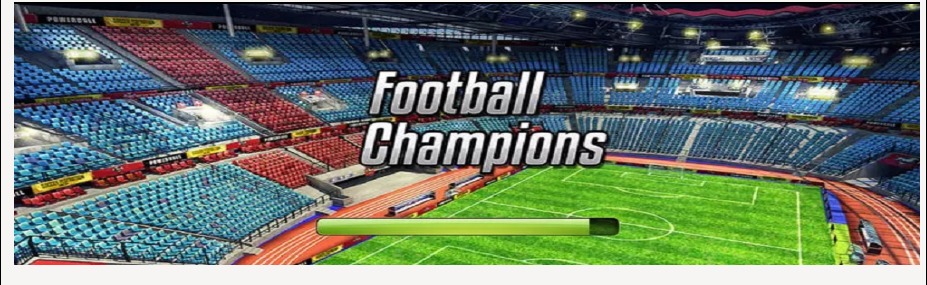

#### Question Area
Just below the main image of the website, we have questions to test the users knowledge on different tournaments. The user has guidlines as answers are provided for the user to select one answer then click on a submit button to submit his answer.
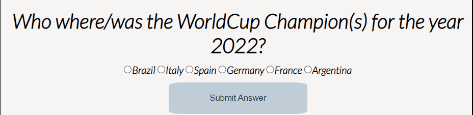

#### Correction
This is where the user can improves his knowledge about Football Champions. Each time he or she submits and answer he is notified in text from if he got it right or wrong. The correct answer is also displayed and to the right a supporting image of the team or person representing the correct answer.
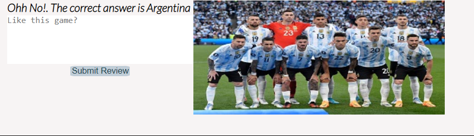

#### Review
To be able to keep improving on this website, a box is provided where a user can tell us how they feel about the website for example what they think can be improved, what they like about the website or just anything.

#### Help Page
This page guides the user on what is expected from him or her in order to get the best user experience. It is 
a set of simple instructions to follow.
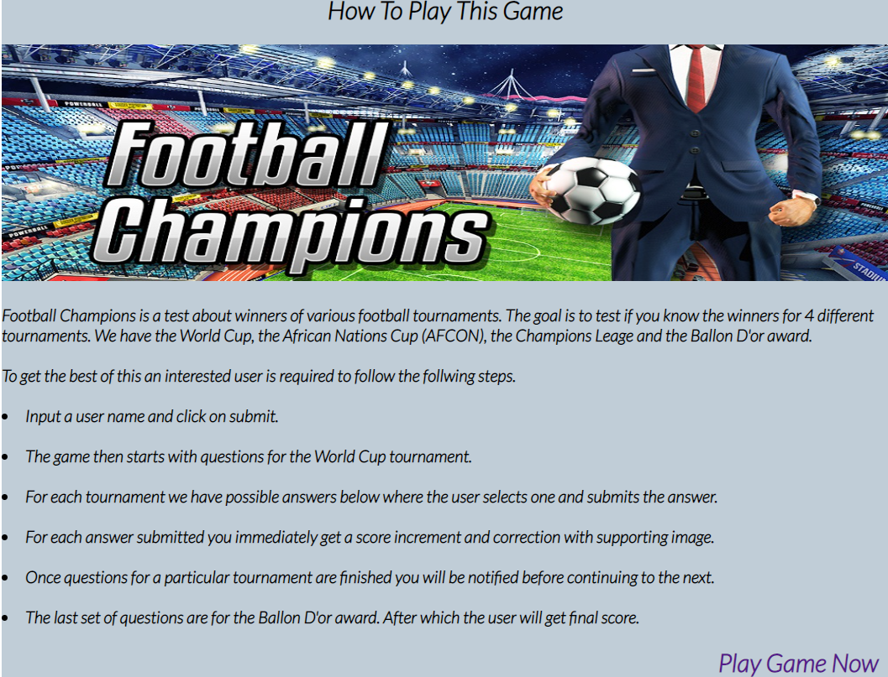

## Testing
This website has been tested firstly on different screen sizes to improve user experience. On tablets, laptops and other bigger screens we have a side bar with the different tournaments serving as sets of questions. But on smaller screen sizes like phones there is no side bar. We have these tournaments on the top as a menu.

#### Validator Testing
- HTML
No errors were returned when passing through the official [W3C validator](https://jigsaw.w3.org/css-validator/validator?uri=https%3A%2F%2Ff-clement.github.io%2Ffootball-champion%2F&profile=css3svg&usermedium=all&warning=1&vextwarning=&lang=en)

- CSS
No errors were found when passing through the official [(Jigsaw) validator](https://validator.w3.org/nu/?doc=https%3A%2F%2Ff-clement.github.io%2Ffootball-champion%2F)

- [jshint](https://jshint.com/) :No errors. A couple of version control warnings.

#### Lighthouse Testing
- Desktop
 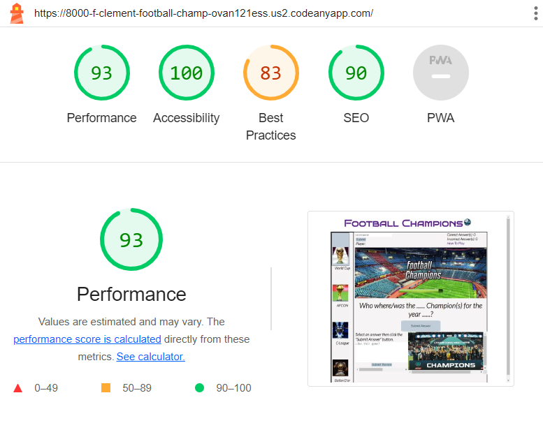

- Mobile
  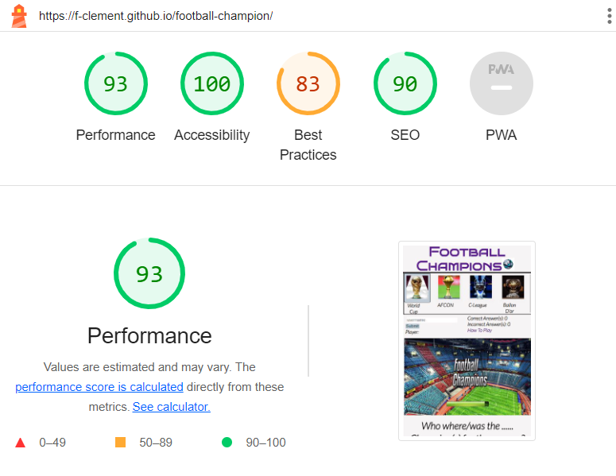

  - In the table below you can see other test done manually.

<table>
    <tr>
        <th>Action</th>
        <th>Expected Results</th>
        <th>Actual Results</th>
    </tr>
    <tr>
        <td>Enter live link for football champions in the browser</td>
        <td>Page loads without any question and expects user to submit a name</td>
        <td>Pass</td>
    </tr>
    <tr>
        <td>Click on submit button without inputing user name</td>
        <td>Browser alerts you to input user name</td>
        <td>Pass</td>
    </tr>
    <tr>
        <td>Input text as username then click submit</td>
        <td>Browser alerts a welcome to football champions message and first question on World Cup loads</td>
        <td>Pass</td>
    </tr>
    <tr>
        <td>Click on World Cup button without inputing a user name</td>
        <td>Browser alerts you to submit a username</td>
        <td>Pass</td>
    </tr>
    <tr>
        <td>Click on the AFCON button without inputing a user name</td>
        <td>Browser alerts you to submit a username</td>
        <td>Pass</td>
    </tr>
    <tr>
        <td>Click on the CLeague button without inputing a user name</td>
        <td>Browser alerts you to submit a username</td>
        <td>Pass</td>
    </tr>
    <tr>
        <td>Click on the Ballon D'or button without inputing a user name</td>
        <td>Browser alerts you to submit a username</td>
        <td>Pass</td>
    </tr>
    <tr>
        <td>Click on the World Cup button after submiting a user name</td>
        <td>Questions about the World Cup display</td>
        <td>Pass</td>
    </tr>
    <tr>
        <td>Click on the AFCON button after submiting a user name</td>
        <td>Questions about the AFCON display</td>
        <td>Pass</td>
    </tr>
    <tr>
        <td>Click on the CLeague(Champions League) button after submiting a user name</td>
        <td>Questions about the CLeague display</td>
        <td>Pass</td>
    </tr>
    <tr>
        <td>Click on the Ballon D'or button after submiting a user name</td>
        <td>Questions about the Ballon D'or display</td>
        <td>Pass</td>
    </tr>
    <tr>
        <td>Click on the Submit Answer button without selecting an answer</td>
        <td>Text is displayed below that you should select at least one answer but incorrect answer are incremented</td>
        <td>Pass</td>
    </tr>
    <tr>
        <td>Click on the Submit Answer button after selecting and answer</td>
        <td>Code checks if answer is correct or incorrect then increments correct answers if correct and incorrect answers otherwise</td>
        <td>Pass</td>
    </tr>
    <tr>
        <td>Click to submit review without username</td>
        <td>Browser alerts user to submit a user name first</td>
        <td>Pass</td>
    </tr>
    <tr>
        <td>Click to submit empty review after submiting username</td>
        <td>Browser alerts user that he or she is trying to submit an empty review </td>
        <td>Pass</td>
    </tr>
    <tr>
        <td>Click to submit review(some text) after submiting username</td>
        <td>Browser alerts user that review has been submitted </td>
        <td>Pass</td>
    </tr>
    <tr>
        <td>Submit and answer</td>
        <td>User is told the correct answer with a corresponding image to support the answer.</td>
        <td>Pass</td>
    </tr> 
    <tr>
        <td>Click on AFCON when you are not done with world cup questions</td>
        <td>Button does not work</td>
        <td>Pass</td>
    </tr>
    <tr>
        <td>Click on C-League when you are not done with world cup questions</td>
        <td>Button does not work</td>
        <td>Pass</td>
    </tr>
    <tr>
        <td>Click on Ballon D'or when you are not done with world cup questions</td>
        <td>Button does not work</td>
        <td>Pass</td>
    </tr>
    <tr>
        <td>Click on AFCON when you just finished with world cup questions</td>
        <td>Button works just once then, stops working</td>
        <td>Pass</td>
    </tr>
    <tr>
        <td>Click on World Cup, C-League or Ballon D'Or button when answering AFCON questions</td>
        <td>The buttons don't work</td>
        <td>Pass</td>
    </tr><tr>
        <td>click on C-League when you just finished answering AFCON questions</td>
        <td>Button works once and then stops</td>
        <td>Pass</td>
    </tr>
    </tr><tr>
        <td>Clicking on World Cup, AFCOn or Ballon D'Or buttons when answering C-League questions</td>
        <td>The Buttons don't work</td>
        <td>Pass</td>
    </tr>
    </tr><tr>
        <td>Click on Ballon D'Or just after you finish with C-League questions</td>
        <td>Buttons worls once and then is disabled.</td>
        <td>Pass</td>
    </tr>
    </tr><tr>
        <td>Click on World Cup, AFCON or C-League when answering Ballon D'Or questions.</td>
        <td>The buttons don't work</td>
        <td>Pass</td>
    <tr>
        <td>Clicking Submit Answer after the World Cup questions are finished and user has not clicked on AFCON</td>
        <td>Button is disabled</td>
        <td>Pass</td>
    </tr>
    </tr><tr>
        <td>Clicking on Submit Answer after the AFCON question are finished and user has not clicked on C-League</td>
        <td>Button does not work</td>
        <td>Pass</td>
    </tr>
    </tr><tr>
        <td>Clicking on Submit Answer after the C-League questions are finished and user has not clicked on Ballon D'Or</td>
        <td>Button does not work</td>
        <td>Pass</td>
    </tr>
    </tr><tr>
        <td>After use answers last question in Ballon D'Or set of questions</td>
        <td>User's score should be displayed as a percentage</td>
        <td>Pass</td>
    </tr>  
</table>

#### Testing Responsivenes

- Below is an image showing the display of the website on various screen sizes.

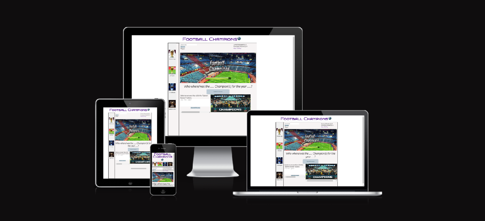

## Deployment

The site was deployed to GitHub pages. The steps to deploy are as follows:
- In the GitHub repository, navigate to the Settings tab
- In the settings page, click on pages on the left side bar.
- when in pages, select the Master Branch from the source section drop-down menu. Selec root too and click save.
- Refresh your page and then you will see a notification that says your website has been deployed with the live link.

  - The live link for this website is: https://f-clement.github.io/football-champion/

## Credits

### Media

- All images on this website including the favicon are images downloaded from [google](https://www.google.com/) then cropped.

### Text Content

- The answers to the World Cup questions are from [fox sport](https://www.foxsports.com/soccer/2022-fifa-world-cup/history)

- The answers to the AFCON questions are from [topend sports](https://www.topendsports.com/events/soccer/africa-cup-nations/winners-list.htm)

- The answers to our Ballon D'or questions are from  [Olympics](https://olympics.com/en/news/uefa-champions-league-ucl-winners-list-football-club-teams)

-  At [Soccer prime](https://soccerprime.com/ballon-dor-winners/) we have list of Ballon D'or winners and years.

### Code

- Got ideas about how to get the value of a radio button in form from [Stack Overflow](https://stackoverflow.com/questions/9618504/how-to-get-the-selected-radio-button-s-value)
-  Looked up on [Stack Overflow](https://stackoverflow.com/questions/60365272/display-current-button-of-multiple-set-of-buttons) for how to highlight which tournament user is onn.